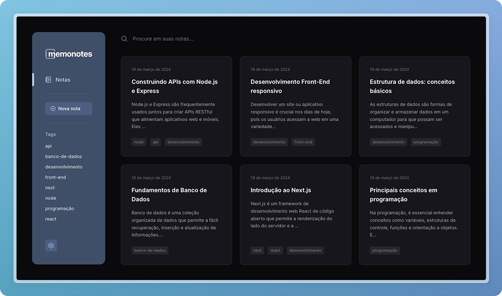
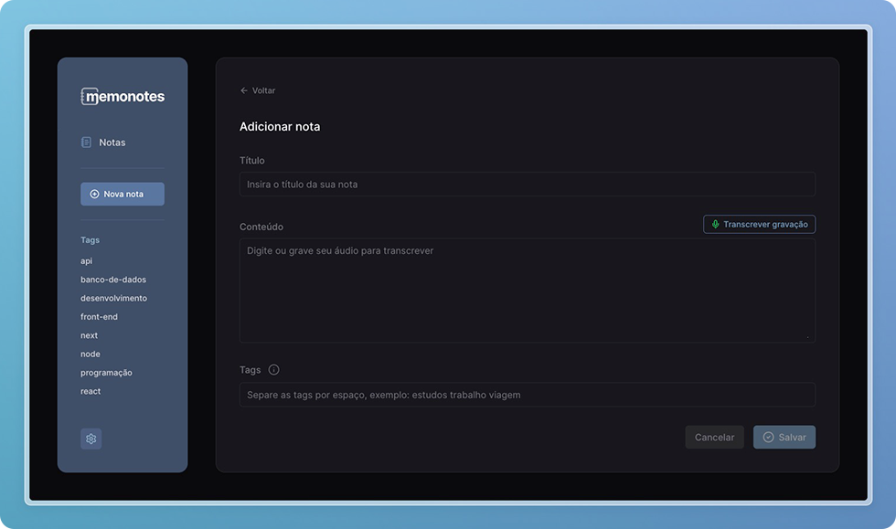
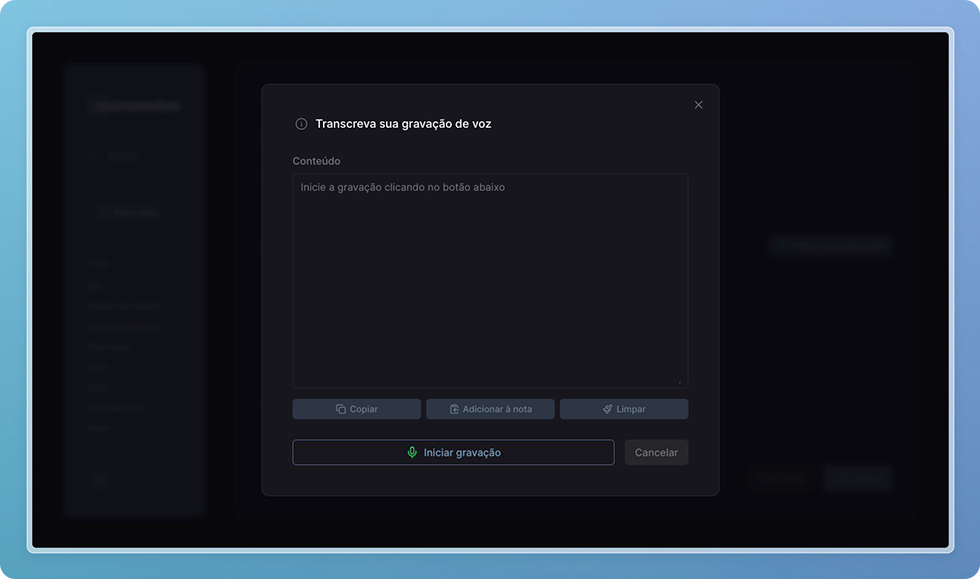

# Memonotes

Memonotes é uma aplicação web para gerenciar notas de texto, incluindo a função de transcrição em tempo real (speech-to-text) através do uso da `Speech Recognition Web API`. Foi desenvolvida em Next para fins de estudos e exercícios práticos no desenvolvimento front-end, implementando recursos de acessibilidade, usabilidade e boas aplicações de UI e UX design.

## Tecnologias utilizadas


## Funcionalidades e características

- Gerenciamento de notas:
  - Adicionar, editar, remover;
  - Pesquisar por palavra no título ou conteúdo;
  - Filtar por tag;
- Captura de voz e transcrição em tempo real *(disponível apenas em alguns navegadores)*;
- Navegação funcional por teclado e mouse;
- Temas claro e escuro.

## Instalação e execução local

Clone este repositório, em seguida, acesse a pasta do projeto e instale as dependendências necessárias seguindo os comandos abaixo:

```bash
git clone https://github.com/julianosill/memonotes.git
cd memonotes
pnpm install
```
Na sequência, inicie a aplicação localmente com o comando:

```bash
pnpm dev
```

A aplicação estará disponível através do endereço informado no seu terminal, por exemplo: [http://localhost:3000](http://localhost:3000).

## Screenshots do projeto






## Próximas etapas

- [ ] Incluir animações melhorar a experiência do usuário
- [ ] Realizar integração com banco de dados
- [ ] Adicionar cadastro de usuários, área de login e autenticação

---

<sup>Desenvolvido por [Juliano Sill](https://github.com/julianosill)</sup>