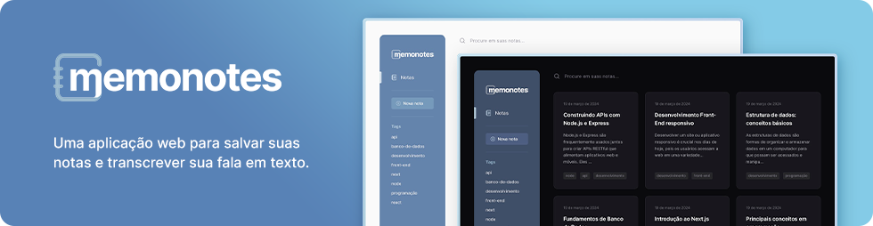
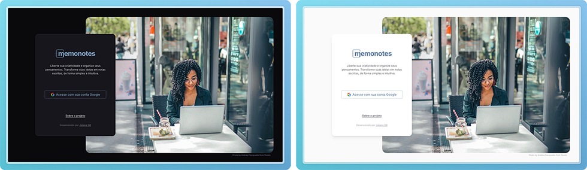
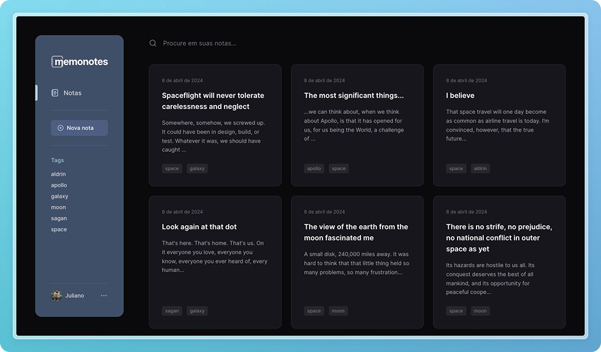
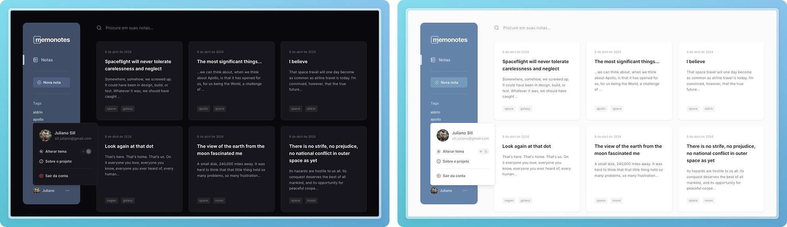
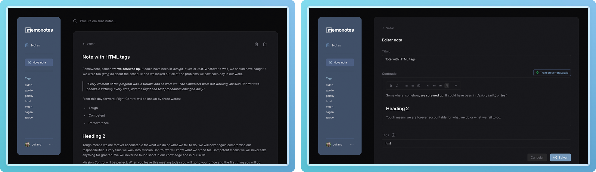
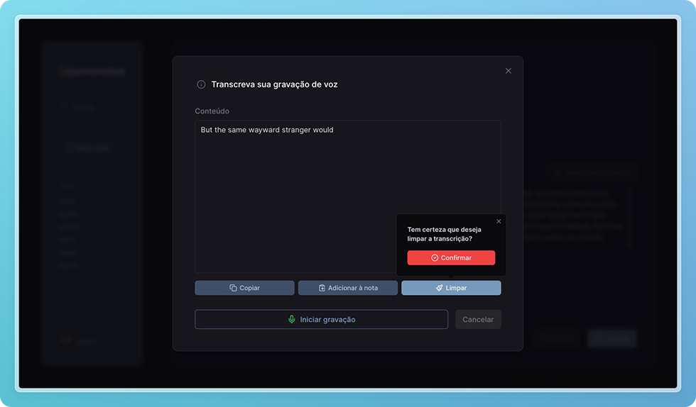

# Memonotes

Aplicação web para gerenciar notas de texto, incluindo a função de transcrição em tempo real (Speech to Text) com uso da `Speech Recognition Web API`. Foi desenvolvida em Next.js 14, com autenticação através do Google e integração com Firebase (banco de dados NoSQL). Também conta com implemetação de recursos de acessibilidade, usabilidade e boas aplicações de UI e UX design.

🔗 [Acesse a aplicação](https://memonotes.julianosill.com.br)

Obs.: a transcrição (Speech to Text) só está disponível em poucos navegadores até o momento, como Chrome e Safari.
Confira os navegadores compatíveis [nesta página](https://developer.mozilla.org/en-US/docs/Web/API/SpeechRecognition#browser_compatibility).

## Tecnologias utilizadas


## Funcionalidades e características

- Gerenciamento de notas:
  - Adicionar, editar, remover;
  - Pesquisar por palavra no título ou conteúdo;
  - Filtar por tag;
- Transcrição em tempo real através de captação de voz *(disponível apenas em alguns navegadores)*;
- Navegação funcional por teclado e mouse;
- Temas claro e escuro.

## Instalação e execução local

Para iniciar, crie ou adicione o projeto da aplicação web no [Firebase](https://firebase.google.com/?hl=pt) e ative o banco de dados Firestore. Copie/salve as credenciais do projeto (API keys).

Em seguida, crie as credenciais da aplicação na [Google Cloud Platform](https://cloud.google.com), com os seguintes dados:

```
- Tela de permissão OAuth

-- Domínio do app
Página inicial do aplicativo: http://localhost:3000

-- Domínios autorizados
Domínio autorizado 1: localhost:3000


- Credenciais / IDs do cliente OAuth 2.0

-- Origens JavaScript autorizadas
URIs 1: http://localhost:3000

-- URIs de redirecionamento autorizados
URIs 1: http://localhost:3000/api/auth/callback/google
```

Copie/salve os dados de `ID do cliente` e `Chave secreta do cliente`.

Em seguida, clone este repositório, acesse a pasta do projeto e instale as dependendências necessárias, seguindo os comandos:

```bash
git clone https://github.com/julianosill/memonotes.git
cd memonotes
pnpm install
```

Crie um arquivo `.env.local` na pasta raíz do projeto ou renomeie o arquivo `.env.local_sample` e adicione as variáveis de ambiente conforme o exemplo abaixo:

```bash
# Next Auth
NEXTAUTH_SECRET=
NEXTAUTH_URL="url_da_sua_aplicação"

# Google oAuth (gere sua chave de API e configure através do Google Cloud Console)
GOOGLE_CLIENT_ID=
GOOGLE_CLIENT_SECRET=

# Firebase / Firestore database
API_KEY=
AUTH_DOMAIN=
PROJECT_ID=
STORAGE_BUCKET=
MESSAGING_SENDER_ID=
APP_ID=
MEASUREMENT_ID=

COLLECTION_NAME="nome_da_colecão_no_firestore"

# App
NEXT_PUBLIC_APP_BASE_URL="url_da_sua_aplicação"
```

Inicie a aplicação localmente com o comando:

```bash
pnpm dev
```

A aplicação estará disponível através do endereço informado no seu terminal, por exemplo: [http://localhost:3000](http://localhost:3000).

## Screenshots do projeto







---

<sup>Desenvolvido por [Juliano Sill](https://github.com/julianosill)</sup>